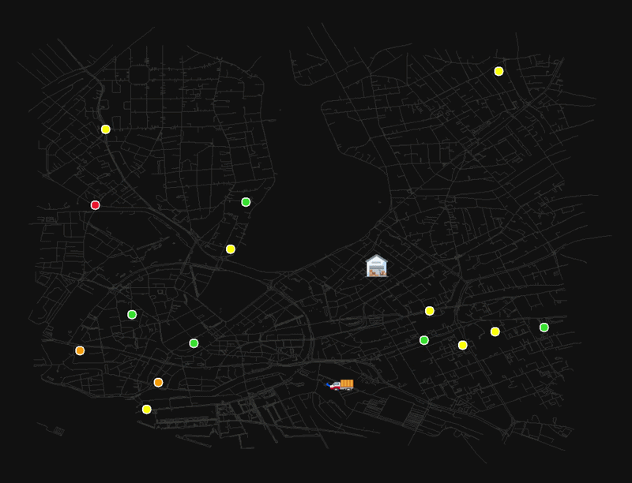
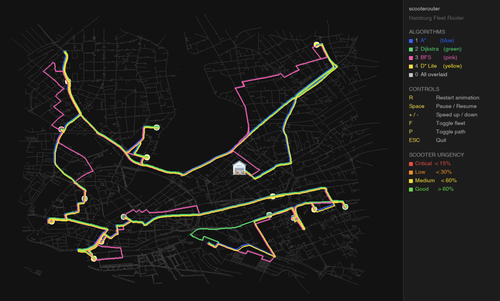
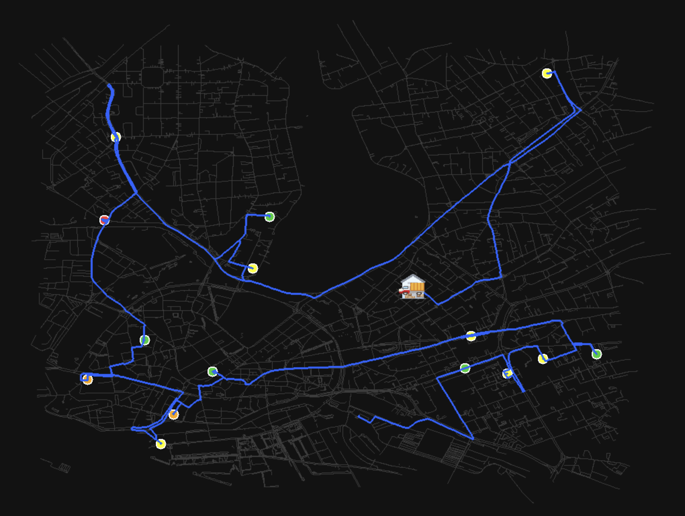
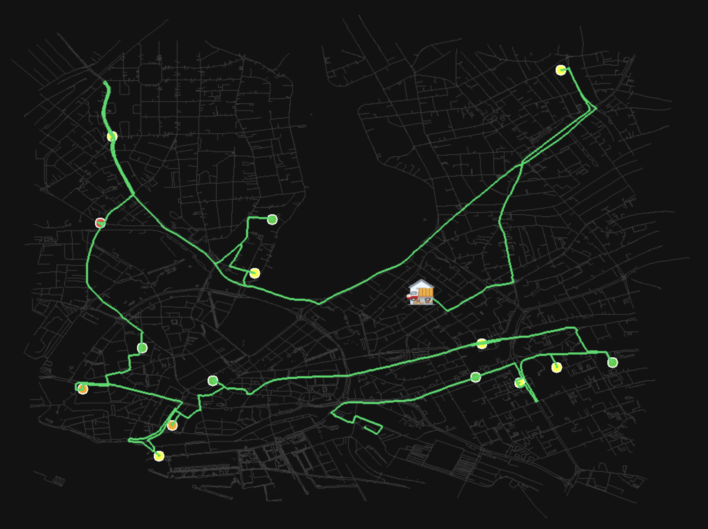
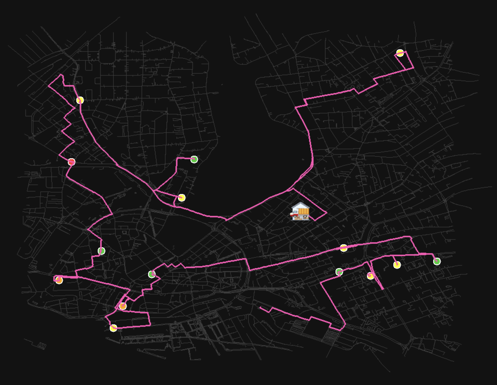
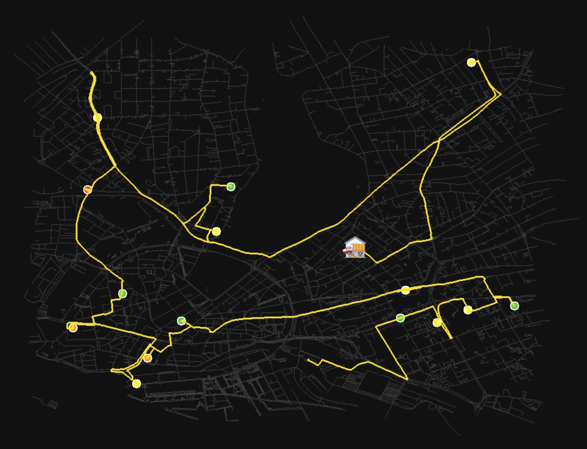
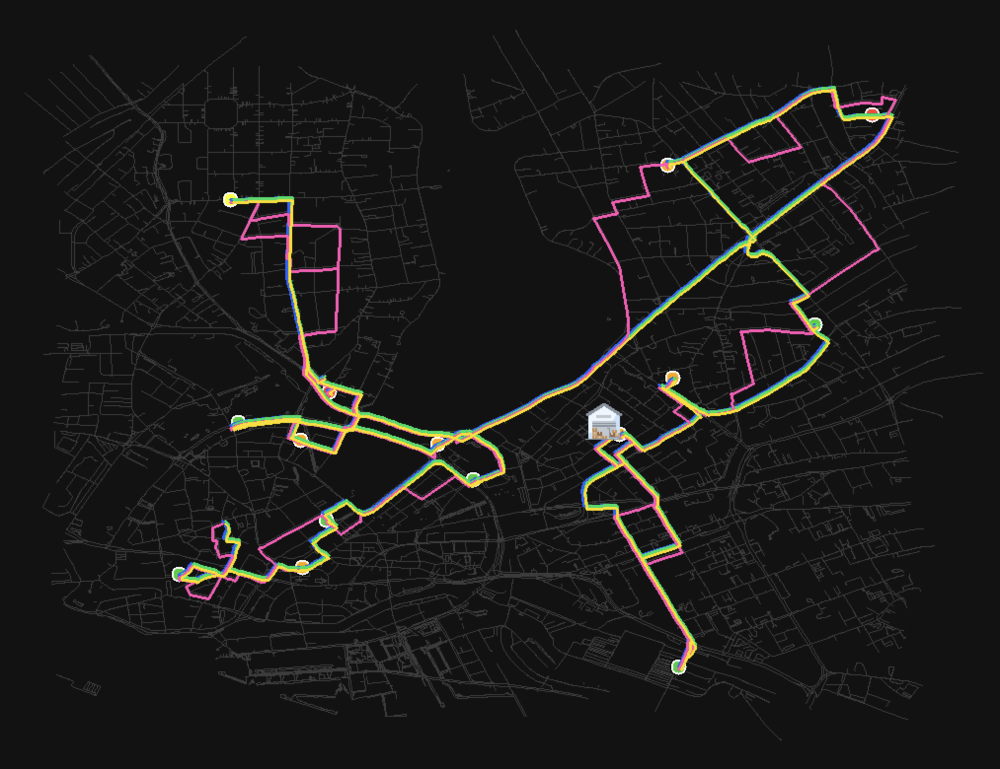

# scooterouter

A real-time route planner that dispatches a collection van across Hamburg to recover e-scooters from the streets — built in C++17 on top of real OpenStreetMap data.

The van spawns at a random location on the Hamburg road network, scores and prioritizes scooters by battery level and damage status, computes the optimal collection order using 2-opt VRP, and animates the full mission live. Switch between 4 pathfinding algorithms and watch how each one routes differently across 25,299 nodes and 44,536 edges.



---

## How it works

1. Hamburg OSM road network loads (25,299 nodes, 44,536 edges)
2. N scooters spawn at random positions on the graph, color-coded by battery urgency
3. A van spawns at a random valid node
4. Routes are precomputed for all 4 algorithms
5. The van animates along the chosen route, collecting scooters in priority order
6. Mission ends when the van returns to the warehouse

---

## Controls

| Key | Action |
|-----|--------|
| `1` | A* route (blue) |
| `2` | Dijkstra route (green) |
| `3` | BFS route (pink) |
| `4` | D* Lite route (yellow) |
| `0` | All algorithms overlaid |
| `R` | Restart animation |
| `Space` | Pause / Resume |
| `+` / `-` | Speed up / slow down van |
| `F` | Toggle scooter markers |
| `P` | Toggle route path |
| `ESC` | Quit |

---

## Algorithms

| Algorithm | Color | Description | Time (Hamburg debug) |
|-----------|-------|-------------|----------------------|
| A* | 🔵 Blue | Heuristic search with Euclidean distance. Fastest optimal planner. | 18ms |
| Dijkstra | 🟢 Green | Exhaustive shortest path. Optimal but explores more nodes than A*. | 24.8ms |
| BFS | 🩷 Pink | Unweighted breadth-first search. Ignores road costs, finds shortest hop count. | 12ms |
| D* Lite | 🟡 Yellow | Incremental replanner designed for dynamic obstacles. Uses A* path as fallback. | — |
| Nearest neighbor + 2-opt | — | VRP ordering: greedy nearest-neighbor insertion followed by 2-opt local search to minimize total collection distance. | — |

Benchmarks run on Apple M4, debug build.

---

## Screenshots



| A* (blue) | Dijkstra (green) |
|-----------|-----------------|
|  |  |

| BFS (pink) | D* Lite (yellow) |
|------------|-----------------|
|  |  |



---

## Scooter urgency

| Color | Battery level |
|-------|--------------|
| 🔴 Red | Critical — below 15% |
| 🟠 Orange | Low — below 30% |
| 🟡 Yellow | Medium — below 60% |
| 🟢 Green | Good — above 60% |

---

## Stack

C++17 · SDL2 · SDL2_image · SDL2_ttf · libosmium · CMake · Ninja · vcpkg · Google Benchmark · GoogleTest · fmt · CLI11

---

## Build
```bash
git clone https://github.com/mohamedabdelfatah97/scooterouter.git
cd scooterouter
cmake -B build -G Ninja \
  -DCMAKE_TOOLCHAIN_FILE=~/dev-cpp/vcpkg/scripts/buildsystems/vcpkg.cmake \
  -DCMAKE_BUILD_TYPE=Release
cmake --build build
./build/scooterouter
```

Options:
```bash
./build/scooterouter --scooters 20    # change number of scooters
./build/scooterouter --seed 42        # fix random seed for reproducibility
./build/scooterouter --width 1600 --height 900
```

---

## Data

OSM extract for Hamburg via Overpass API. The map file (`data/maps/hamburg.osm`) is gitignored due to size — download with:
```bash
wget -O data/maps/hamburg.osm "https://overpass-api.de/api/map?bbox=9.9665,53.5371,10.0466,53.5837"
```